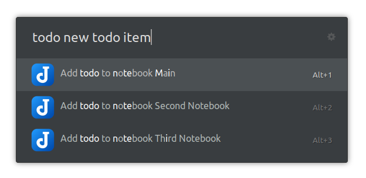

# Ulauncher Joplin
### [Ulauncher](https://ulauncher.io) extension for quickly creating notes and todos in Joplin.

## Screenshots

## Use
> note My note title
>
> todo My todo title

Create a note or a todo with the keywords `note` or `todo`. 
A list of notebooks sorted by note count will be shown and you can select in which notebook the note or todo should be stored.

## Settings

The **number of notebooks** that are shown can be changed in the extension's settings.

## Install
> https://github.com/KuenzelIT/ulauncher-joplin

Copy and paste this repository link inside __Add extension__ in Ulauncher's settings panel.
